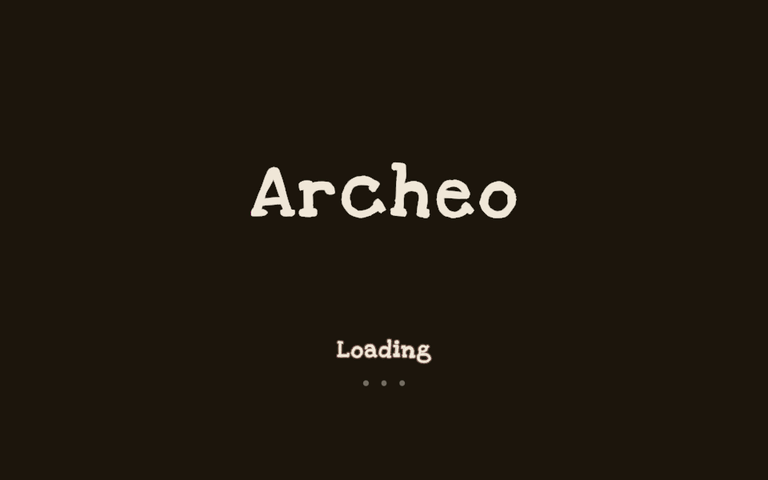
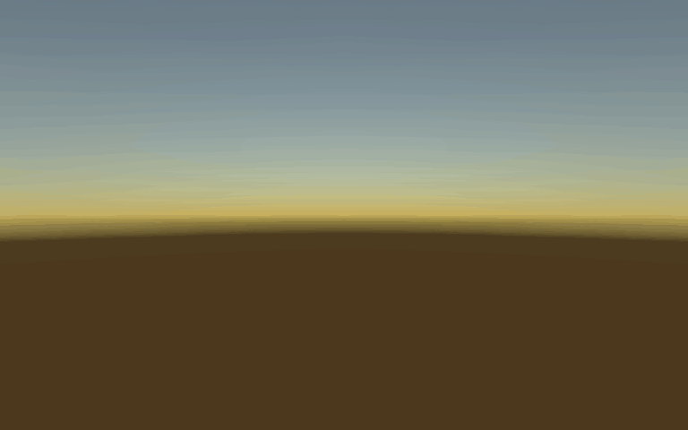

# Project Template

A Unity starting point for a small cooperative game: menus, Steam lobbies, Photon sessions, voice chat, settings and local saves.

## Interface

| Loading | Settings | Pause |
| --- | --- | --- |
|  |  |  |

GIFs render the project's actual UI scenes in an offline preview; the room code and loading progress are demonstration values.

- Main menu: host, join by room code, settings, credits and quit.
- Host flow: choose/create a save, set player limit and lobby access.
- Settings: general/language, controls and rebinding, graphics, audio/microphone, region and ping.
- Pause: continue, Steam invite overlay, settings, copy room code and leave.
- English and Russian string tables; animated loading and error dialogs.

## Under the hood

**Unity 6000.5.8f1 · URP · C# · VContainer · UniTask · DOTween**

Steam lobbies carry the Photon room code and region. Photon Fusion runs host/client sessions; Photon Voice provides voice chat. Session shutdown returns players to the menu. JSON settings include backup recovery; save files are separated by player identity.

| Scene | Purpose |
| --- | --- |
| `Bootstrap` | Application lifetime, services and shared UI |
| `Menu` | Main menu, host/join and save selection |
| `Lobby` | Session lobby and player spawning |
| `Game` | Minimal scene to extend with gameplay |

`Assets/Game/Services` contains application systems, `Flow` coordinates screens/scenes, `Scopes` configures dependency injection, and `UI` contains views, handlers and presentation assets.

## Run locally

Follow **[installation and Steam testing](Documentation/Setup.md)** before opening Play Mode. SDK source/binaries, paid sound packs, credentials, build outputs and editor caches are intentionally excluded. Unity packages declared in `Packages/manifest.json` restore through Package Manager.

Start from `Assets/Game/Scenes/Bootstrap.unity`. Use two machines/accounts to test host → invite/join → leave/disconnect.

This is a template, not a finished game: the player prefab retains networking, voice and save hooks, but has no character model, ragdoll or movement controller. Photon authentication currently uses a locally generated development ID, not verified Steam authentication. Host migration is not implemented. Full two-account invitation testing is still pending.

The UI uses **Love Ya Like A Sister** by Kimberly Geswein, distributed under the [SIL Open Font License](Assets/Game/UI/Font/OFL.txt). Third-party SDKs retain their own licenses.
